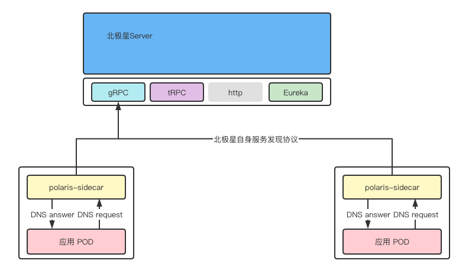

# Polaris Sidecar

English | [中文](./README-zh.md)

## Introduce

Polaris-Sidecar as Polaris's local bike agent, providing two optional functional modes：

- Local DNS: Use DNS parsing to access the services on the Arctic Star
- Service Grid: Realize service discovery and governance by hijacking traffic, and develop invasiveness

Users can select one of the modes to access Polaris-Sidecar. This document describes how to install and use Polaris-Sidecar in a virtual machine or container environment.

## Local DNS mode

### Architecture



### Function

- DNS-based service discovery capabilities: Directly pass the domain name ```<service>.<Namespace>``` to pull the service instance address list.
- Fault nodes eliminate the ability: automatically eliminate unhealthy and isolation instances to ensure business reliability. 
- Label Routing Ability: By configuring tags, filtering and returning a list of service instance addresses that meet label rules.

### Supported DNS question type

- A/AAAA
- SRV

### Installation Notes

#### Precondition

- Before installing and using Polaris-Sidecar, you need to install the Northern Polarite server, please refer to [Polaris Star server installation document](https://polarismesh.cn/zh/doc/%E5%BF%AB%E9%80%9F%E5%85%A5%E9%97%A8/%E5%AE%89%E8%A3%85%E6%9C%8D%E5%8A%A1%E7%AB%AF/%E5%AE%89%E8%A3%85%E5%8D%95%E6%9C%BA%E7%89%88.html#%E5%8D%95%E6%9C%BA%E7%89%88%E5%AE%89%E8%A3%85).

#### Install in a virtual machine environment

1. The virtual machine installation process requires a root user or a user with super administrator privileges to be executed, and ensure that the 53 (UDP / TCP) port is not occupied.
2. Need to download the latest version of the installation package from [Release](https://github.com/polarismesh/polaris-sidecar/releases).
3. Upload installation packages into the virtual machine environment, and decompress, enter the decompressed directory.

```
unzip polaris-sidecar-release_$version.$os.$arch.zip
```

4. Modify polaris.yaml, write the address of the Arctic Star server, port number uses 8091 (GRPC port).

```
global:
  serverConnector:
    addresses:
      - 127.0.0.1:8091
```

5. Enter the decompressed directory, perform tool/start.sh to start, then perform tool/p.sh to view the process whether it is successful.

```
# bash tool/start.sh
# bash ./tool/p.sh
root     15318     1  0 Jan22 ?        00:07:50 ./polaris-sidecar start
```

6. Modify /etc/resolv.conf, add ```Nameserver 127.0.0.0.1```, and add it to all Nameserver records, as follows:

```
; generated by /usr/sbin/dhclient-script
nameserver 127.0.0.1
nameserver x.x.x.x
```

7. Verify the installation, you can get the IP address of the service.

```
# dig polaris.checker.polaris

; <<>> DiG 9.9.4-RedHat-9.9.4-29.el7_2.2 <<>> polaris.checker.polaris
;; global options: +cmd
;; Got answer:
;; ->>HEADER<<- opcode: QUERY, status: NOERROR, id: 10696
;; flags: qr aa rd; QUERY: 1, ANSWER: 1, AUTHORITY: 0, ADDITIONAL: 1
;; WARNING: recursion requested but not available

;; OPT PSEUDOSECTION:
; EDNS: version: 0, flags:; udp: 4096
;; QUESTION SECTION:
;polaris.checker.polaris. IN        A

;; ANSWER SECTION:
polaris.checker.polaris. 10 IN AAAA ::ffff:1.1.1.1

;; Query time: 0 msec
;; SERVER: 127.0.0.1#53(127.0.0.1)
;; WHEN: Wed Jan 26 00:21:34 CST 2022
;; MSG SIZE  rcvd: 127
```

Remarks: If you need to use the domain name to discover, you must ensure that the namespace and service name are registered with a full lowercase on the Northern Star, otherwise it will be addressed.

#### Container environment installation

Polaris-Sidecar mirroring is archived into dockerhub, requiring a deployed environmental network to access DockerHub public mirror warehouse.

1. Refer to [polaris-controller Document](https://github.com/polarismesh/polaris-controller/blob/main/README.md) 
2. Verify the installation, by performing a small JOB to perform DNS resolution verification:

```shell
$ kubectl apply --filename deploy/job/job.yaml
```
3. The POD after deploying Job is detailed below
   
4. After the Job is running, you can confirm the operation by querying the POD log.By default, successful service DNS query results will be output. If an error occurs, the DNS configuration may have problems.

```
# dig polaris.checker.polaris

; <<>> DiG 9.9.4-RedHat-9.9.4-29.el7_2.2 <<>> polaris.checker.polaris
;; global options: +cmd
;; Got answer:
;; ->>HEADER<<- opcode: QUERY, status: NOERROR, id: 10696
;; flags: qr aa rd; QUERY: 1, ANSWER: 1, AUTHORITY: 0, ADDITIONAL: 1
;; WARNING: recursion requested but not available

;; OPT PSEUDOSECTION:
; EDNS: version: 0, flags:; udp: 4096
;; QUESTION SECTION:
;polaris.checker.polaris. IN        A

;; ANSWER SECTION:
polaris.checker.polaris. 10 IN AAAA ::ffff:1.1.1.1

;; Query time: 0 msec
;; SERVER: 127.0.0.1#53(127.0.0.1)
;; WHEN: Wed Jan 26 00:21:34 CST 2022
;; MSG SIZE  rcvd: 127
```